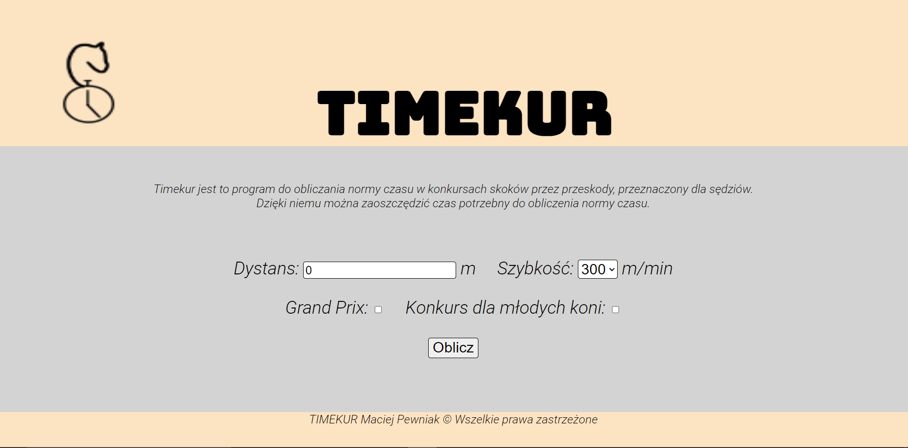

# Timekur
[en] Program for calculating the standard of time in show jumping 
[pl] Program do obliczania normy czasu w konkursach skoków przez przeszkody

# Freatures / Funkcje
[en] Program is calculating the standart of time in Polish show jumping competitions.
In addition, The program checks the correctness of the selected speed.
[pl] Program oblicza normę czasu dla polskich konkursów w skokach przez przeszkody.
W dodatku program sprawdza poprawność wybranej szybkości.
# Development plans / Plany rozwoju
[en] 
* Addition of the English language
* Adding additional features to facilitate the use
[pl]
* Dodanie języka angielskiego
* Dodanie funkcji ułatwiających użytkowanie
# Screenshot / Zrzut ekranu

# Author / Autor
Maciej Pewniak - [@pewnior]
# License / Licencja
[en] All rights reserved
[pl] Wszelkie prawa zastrzeżone
