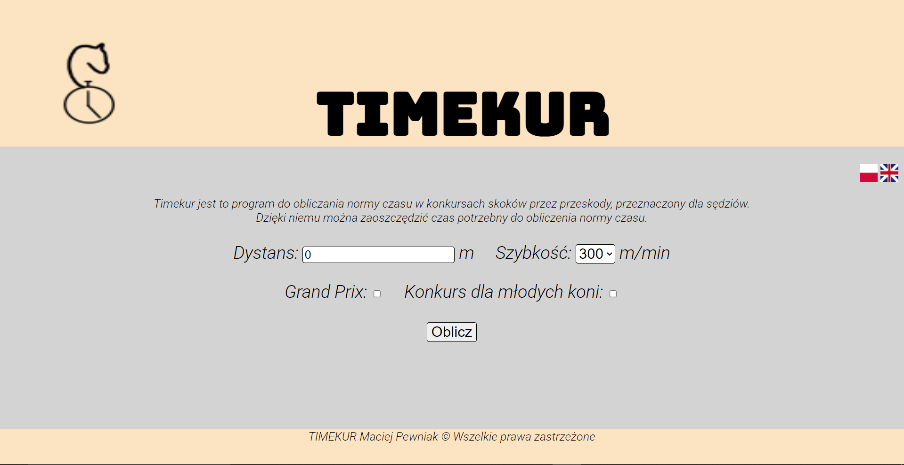

# Timekur
[en] Program for calculating the time allowed in show jumping  
[pl] Program do obliczania normy czasu w konkursach skoków przez przeszkody

# Freatures / Funkcje
[en] Program is calculating the time allowed in Polish show jumping competitions.
In addition, The program checks the correctness of the selected pace. The program is available in both Polish and English language 
[pl] Program oblicza normę czasu dla polskich konkursów w skokach przez przeszkody.
W dodatku program sprawdza poprawność wybranej szybkości. Program jest dostępny w zarówno języku polskim jak i angielskim.
# Development plans / Plany rozwoju
[en]  
-Adding additional features to facilitate the use 
[pl] 
-Dodanie funkcji ułatwiających użytkowanie
# Screenshot / Zrzut ekranu

# Author / Autor
Maciej Pewniak - @pewnior
# License / Licencja
[en] All rights reserved  
[pl] Wszelkie prawa zastrzeżone
